# v0.4 Class Structure — Diagrams

Mermaid source for the v0.4 architecture. Split by layer rather than shown
as one graph, because ~30 classes in a single diagram is unreadable.

Items marked *(v0.5)* are deferred but shown in context so the extension
points are visible.

---

## 1. Layer overview

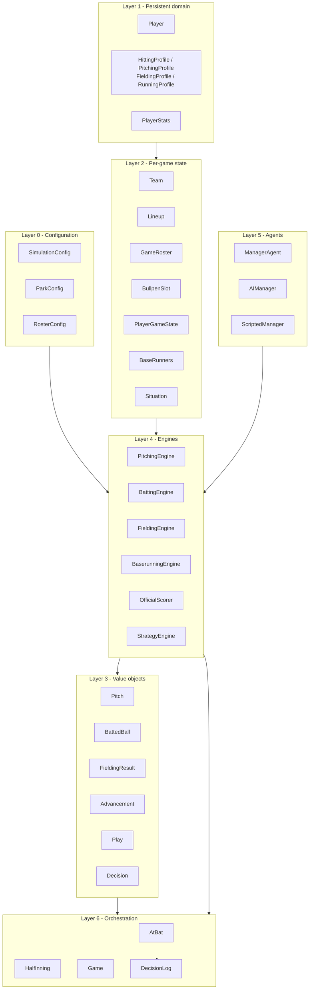

---

## 2. Configuration

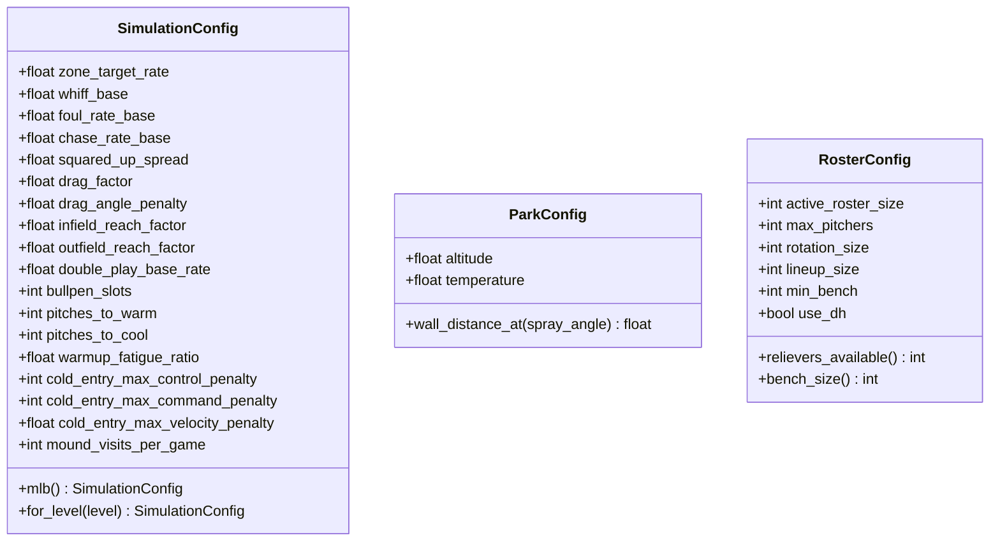

---

## 3. Persistent domain

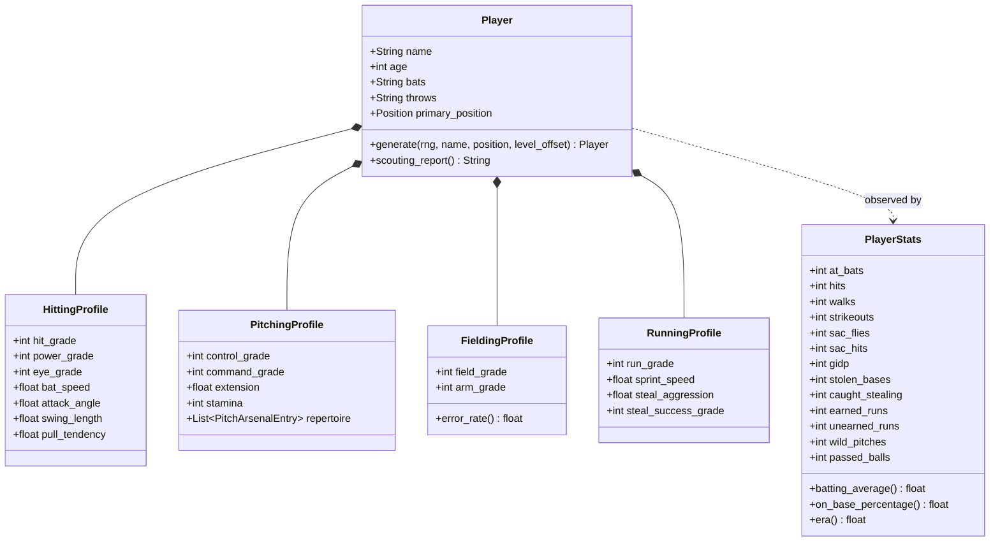

`PlayerStats` is deliberately not owned by `Player`. Ratings are hidden
truth; stats are noisy observation held by the `Team`.

---

## 4. Per-game state

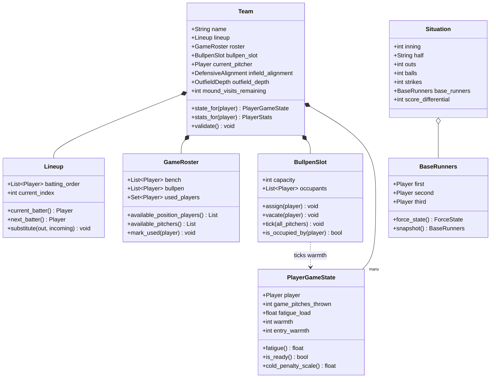

`BullpenSlot.tick()` runs once per game pitch: occupants gain warmth and
fatigue load, everyone else cools. `Situation` is immutable — engines get a
snapshot and cannot reach through it to mutate the game.

---

## 5. Value objects

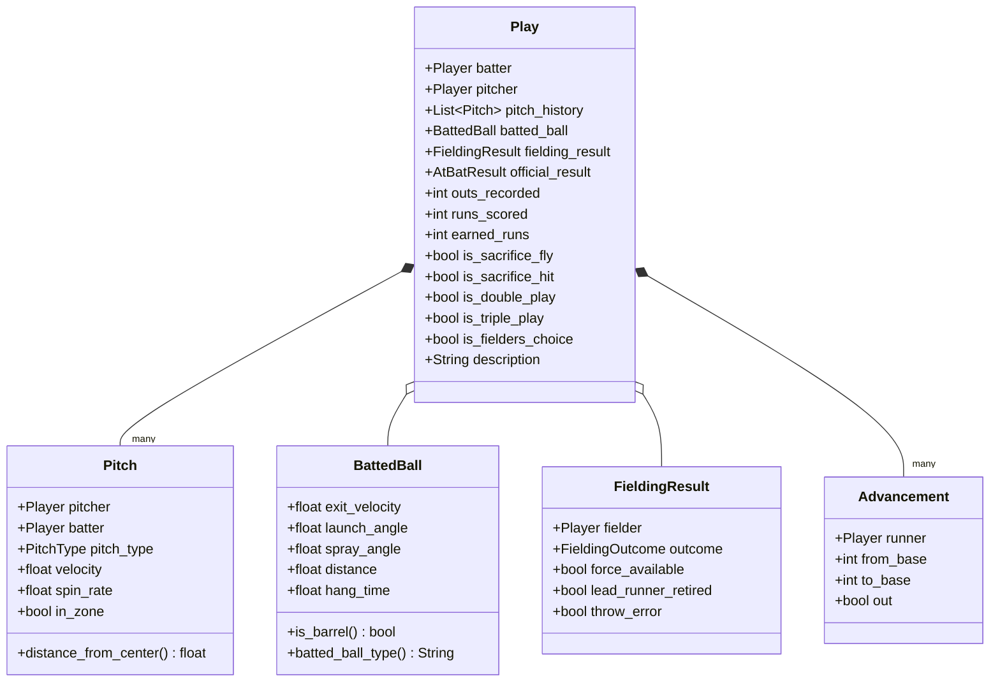

`outs_recorded` is an int, not a bool. That is what makes double and triple
plays expressible.

---

## 6. Engines and agents

```mermaid
classDiagram
    class PitchingEngine {
        +throw_pitch(pitcher, state, batter, situation, rng) Pitch
    }
    class BattingEngine {
        +decide_approach(batter, pitch, situation, rng) Approach
        +resolve_swing(batter, pitch, rng) SwingOutcome
        +make_contact(batter, pitch, rng) BattedBall
        +make_bunt_contact(batter, pitch, rng) BattedBall
    }
    class FieldingEngine {
        +resolve(batted_ball, defense, situation, rng) FieldingResult
    }
    class BaserunningEngine {
        +advance(fielding_result, base_runners, outs, rng) BaserunningResult
    }
    class OfficialScorer {
        +score(outcome, fielding, baserunning, situation) ScoringDecision
        +apply_to_stats(play, offense, defense) void
    }
    class StrategyEngine {
        +pending_decisions(situation, team, roster) List~Decision~
        +apply(decision, choice, game_state) void
        +leverage(situation) float
    }

    class Decision {
        +DecisionKind kind
        +List~Option~ options
        +Option default_option
        +DecisionBoundary boundary
        +DecisionContext context
    }

    class DecisionContext {
        +PlayerStats observed_stats
        +Situation situation
        +BullpenView opposing_bullpen
    }

    class ManagerAgent {
        <<interface>>
        +decide(decision) Option
    }
    class AIManager {
        +decide(decision) Option
    }
    class ScriptedManager {
        +decide(decision) Option
    }
    class HumanManager {
        +decide(decision) Option
    }

    ManagerAgent <|.. AIManager
    ManagerAgent <|.. ScriptedManager
    ManagerAgent <|.. HumanManager
    StrategyEngine ..> Decision : produces
    ManagerAgent ..> Decision : consumes
    Decision *-- DecisionContext
```

`DecisionContext` exposes `PlayerStats` only — never `HittingProfile` or
`PitchingProfile`. The AI judges players on observed results, the same
constraint the human faces.

`BullpenView` carries who is warming and roughly how warm, for both sides.
This is public information in a real game. `HumanManager` is v0.5, shown
here because adding it must be purely additive.

`leverage()` exists in v0.4 for AI heuristics; v0.5 reuses it to decide
which prompts are worth surfacing.

---

## 7. Orchestration

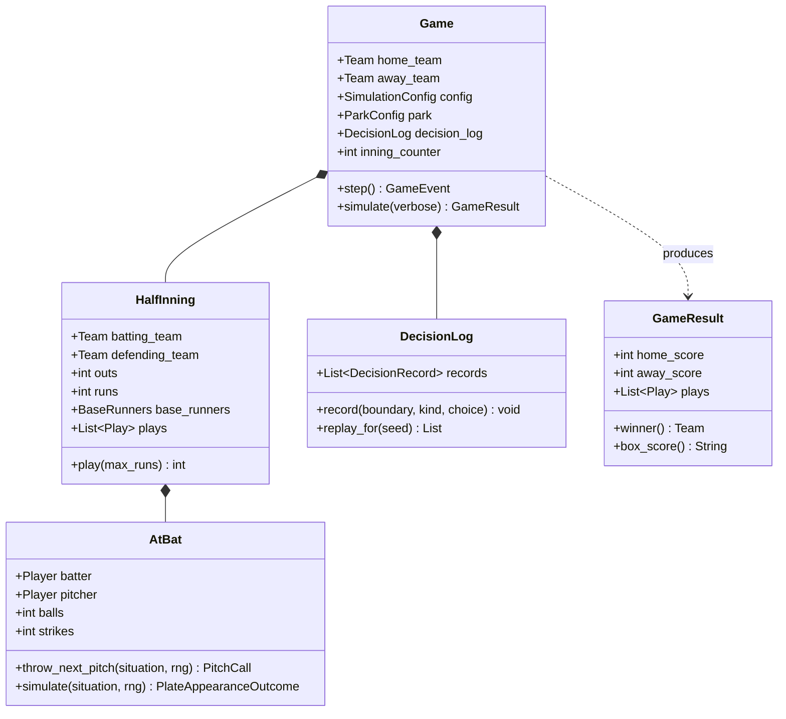

`step()` returns one event; `simulate()` drains it. Seed plus `DecisionLog`
reproduces any game exactly.

---

## 8. Plate appearance sequence

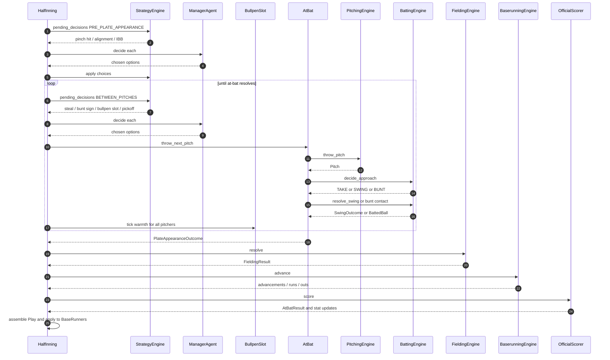

Every arrow is a testable seam. A failing stage names the broken engine.
`BullpenSlot.tick()` fires once per pitch — the single clock that drives
both warming and cooling.

---

## 9. Bullpen warmth

One slot, one counter. States are **derived** from `warmth`, not stored.

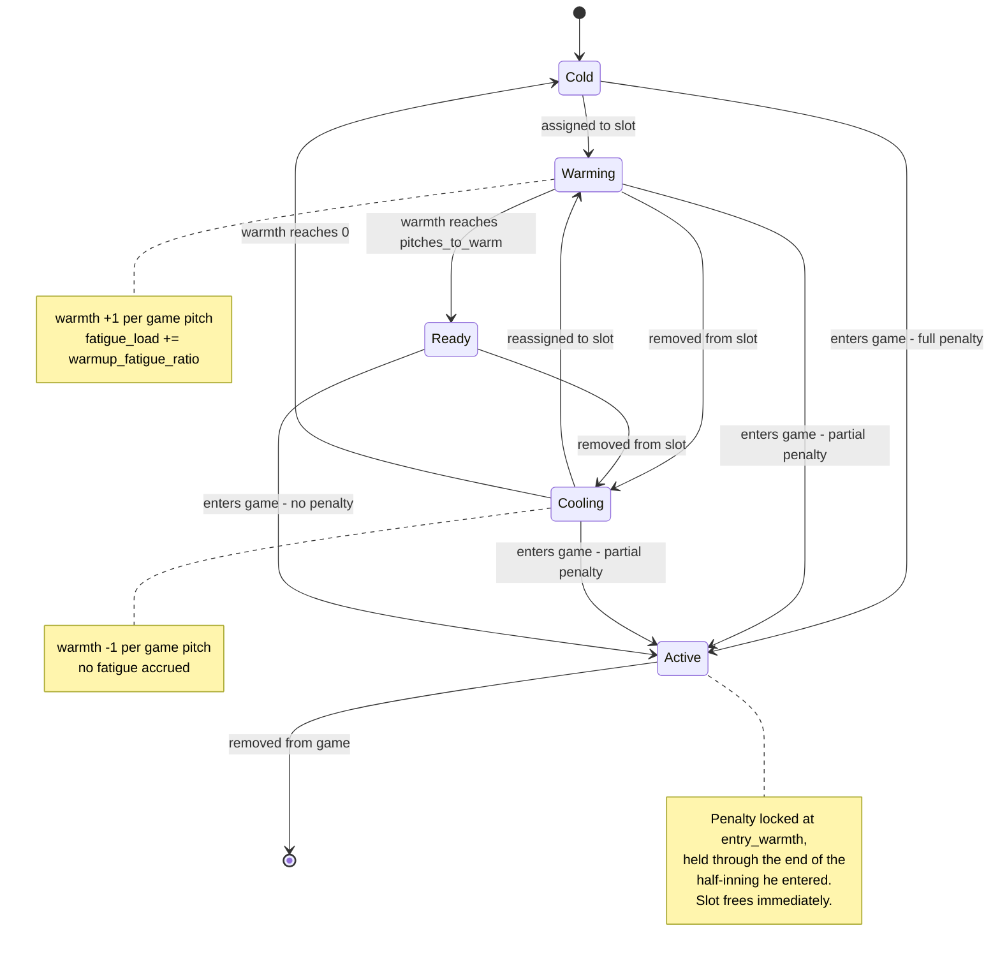

The starting pitcher begins at `warmth = pitches_to_warm` and never enters
the slot; neither does whoever is on the mound.

**Cold-entry penalty** scales continuously:

```
scale = (pitches_to_warm - entry_warmth) / pitches_to_warm

control  -= cold_entry_max_control_penalty  * scale
command  -= cold_entry_max_command_penalty  * scale
velocity -= cold_entry_max_velocity_penalty * scale
```

**Cost of repeat warm-ups**, at `warmup_fatigue_ratio = 0.5` against a
reliever's ~55 stamina:

| Times warmed to ready | Fatigue load | Usable arm |
|---|---|---|
| Once | 15 | ~2.5 innings |
| Twice | 30 | ~1.6 innings |
| Three times | 45 | ~0.6 innings |

---

## 10. Decision boundaries

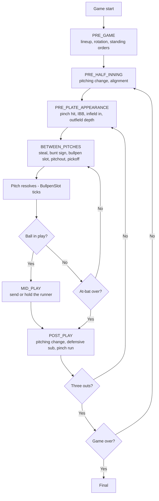

In v0.4 every boundary resolves through `AIManager` without stopping. These
are the points v0.5's real-time mode pauses on.

---

## 11. v0.5 extension *(preview)*

Nothing in the engine changes. One new agent, one routing layer, one loop.

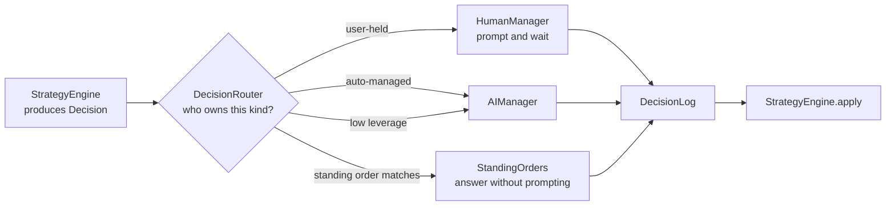

The leverage filter and standing orders sit between the router and the
prompt — that's what keeps ~290 pitches a game from becoming ~290 prompts.
`DecisionLog` records every answer regardless of source, so a human-played
game replays exactly.
